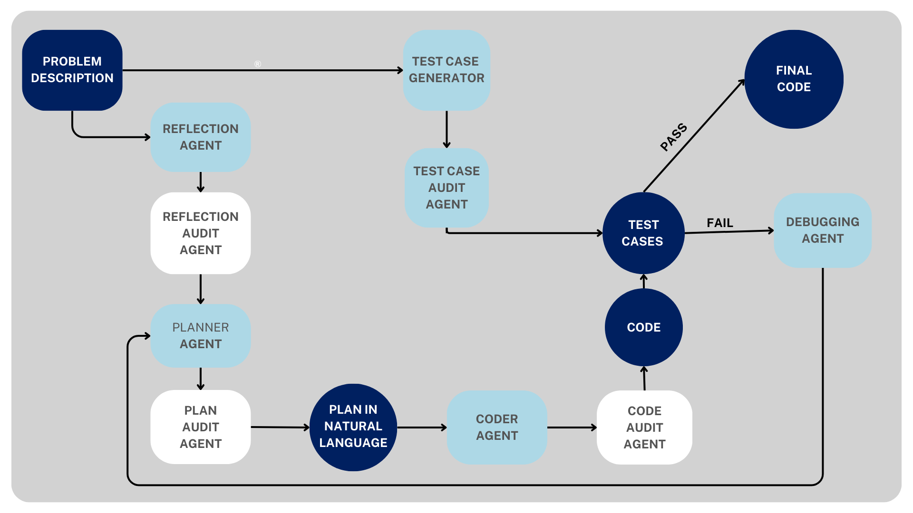

# CodiumX

CodiumX is a multi-agent architecture for enhanced
code generation. This approach proposes dedicated audit agents
at successive workflow stages, facilitating persistent evaluation
and enhancement of intermediate output. Further, it uses AI generated
test cases to refine the generated code. 

## Overview


The system follows a multi-agent approach to solving programming problems:

1. **Reflection**: The reflection agent analyzes the problem statement to understand requirements, constraints, and edge cases. This reflection is then audited to ensure completeness.

2. **Test Case Generation**: The test case generator creates a comprehensive set of test cases to validate solutions, covering normal operation and edge cases. These test cases are reviewed by its audit agent.

3. **Planning**: The planner agent creates a step-by-step approach to solve the problem, breaking it down into logical components. This plan is then verified by the plan audit agent.

4. **Coding**: The coder agent implements the solution based on the verified plan, translating the logical approach into actual code. The code is then reviewed by the code audit agent.

5. **Testing**: The tester validates the solution against the generated test cases, ensuring it passes all of them.

6. **Debugging**: If the solution fails any tests, the debugger identifies the issues and applies fixes, creating an iterative improvement loop between the debugger, planner and the coder agent. 

The architecture is designed to mimic the human coding process by breaking it down into discrete steps, with each specialized agent handling a specific aspect of the solution process. Each agent has got it's own audit agent which incorporates multiple verification steps to ensure that each phase produces high-quality outputs, similar to how human programmers review their own work.


## Agent Workflow

Below is the detailed workflow of how the agents interact:




The multi-agent approach demonstrated in this system shows significant improvements over monolithic approaches to code generation, particularly in handling complex problems with multiple edge cases.


## Project Structure

```
.
├── README.md               # This documentation
├── check.py                # Main code generation script
├── main.py                 # Agent workflow orchestrator
├── self_reflection.py      # Agent for analyzing problems
├── test_case_gen.py        # Agent for generating test cases
├── planner.py              # Agent for planning solutions
├── coder.py                # Agent for implementing code solutions
├── debugger.py             # Agent for debugging failed solutions
├── tester.py               # Agent for testing solutions
├── prompts.py              # Centralized storage for agent prompts
├── setup.py                # Script for importing all the packages
├── requirements.txt        # Project dependencies
└── workflow_diagram.png    # Visual representation of the agent workflow

```

## Usage

### Prerequisites

Install the required dependencies:

```bash
pip install -r requirements.txt
```

### Configuration

CodiumX supports multiple AI models for the agent workflow. You can use any of the following:

- OpenAI (GPT models)
- Groq (Llama, Mixtral models)
- Google (Gemini models)
- Hugging Face models

To configure the system, you have two options:

#### Option 1: Environment Variables

Set the appropriate API key environment variables:

```bash
# For OpenAI models
export OPENAI_API_KEY=your_openai_api_key

# For Groq models
export GROQ_API_KEY=your_groq_api_key

# For Google models
export GOOGLE_API_KEY=your_google_api_key

# For Hugging Face models
export HUGGINGFACE_API_KEY=your_huggingface_token
```

Windows users can use:
```
set OPENAI_API_KEY=your_openai_api_key
```

#### Option 2: Configuration File

The system will automatically generate a `config.json` file on first run. You can modify this file to configure your model preferences:

```json
{
    "active_model": "openai",
    "models": {
        "openai": {
            "model_name": "gpt-4o-mini",
            "api_key_env": "OPENAI_API_KEY"
        },
        "groq": {
            "model_name": "llama-3.3-70b-versatile",
            "api_key_env": "GROQ_API_KEY"
        },
        "google": {
            "model_name": "gemini-1.5-flash",
            "api_key_env": "GOOGLE_API_KEY"
        },
        "huggingface": {
            "repo_id": "meta-llama/Llama-3.3-70B-Instruct",
            "api_key_env": "HUGGINGFACE_API_KEY"
        }
    }
}
```

To switch between models, change the `active_model` to one of: "openai", "groq", "google", or "huggingface".

You can also customize the specific model being used by changing the `model_name` or `repo_id` parameters.

### Generating Code

To generate a solution for a coding problem:

```bash
# Provide the problem description directly
python check.py "Write a function that calculates the factorial of a number"

# Or provide a file containing the problem description
python check.py --file problem.txt

# Save the generated solution to a file
python check.py --file problem.txt --output solution.py
```

You can also run the script without arguments to enter the problem description interactively.


## License

This project is licensed under the MIT License - see the LICENSE file for details. 